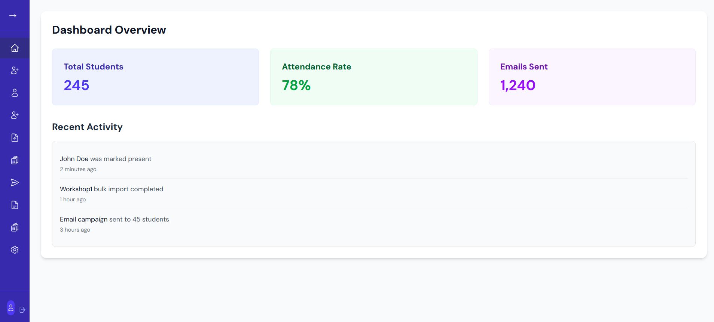
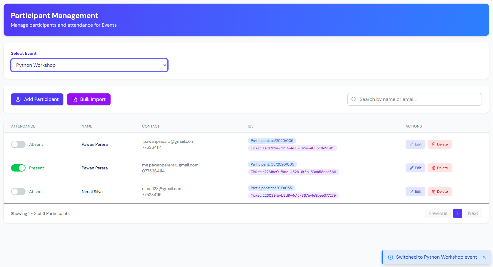
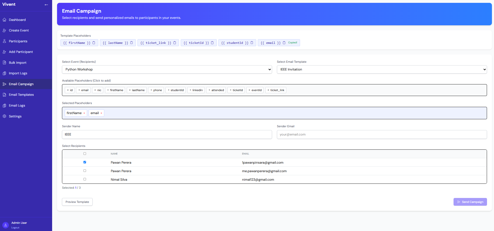
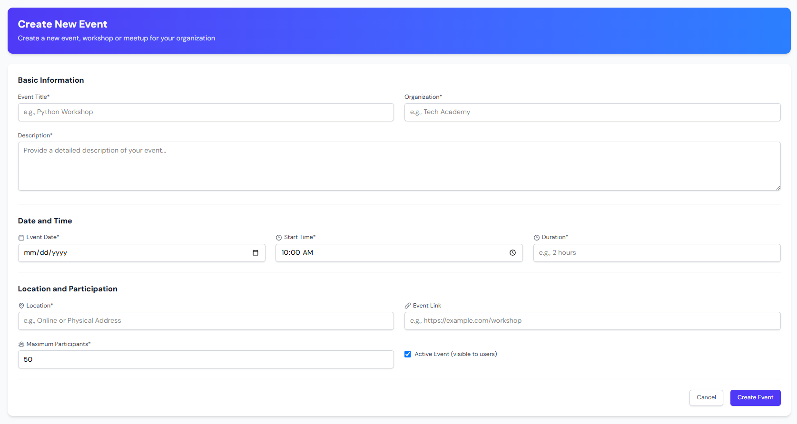
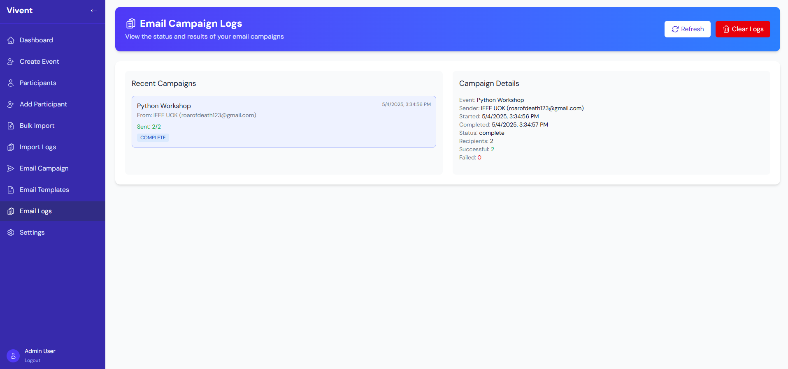
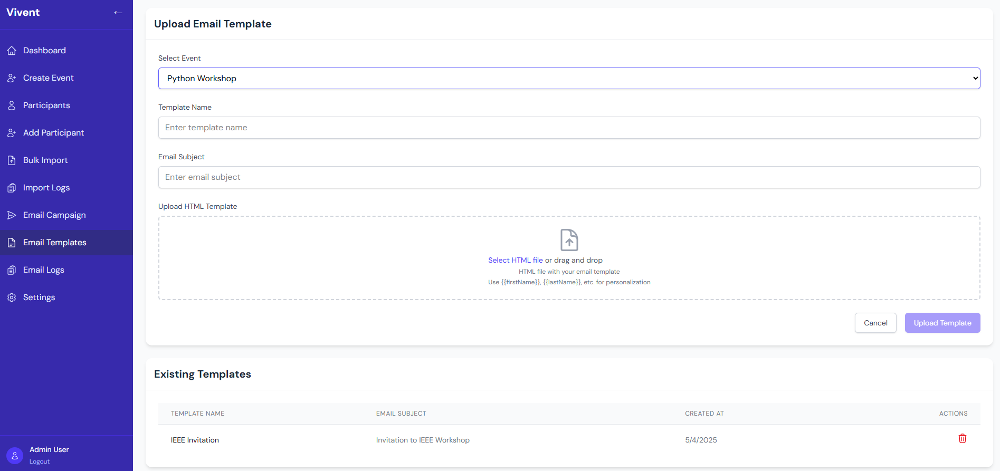

# Vivent Event Management System

A comprehensive event management system for tracking attendance, managing participants, and sending personalized email campaigns for workshops and events.

## Features

- **Student Management**: Add, edit, and delete student records with unique ticket IDs
- **Workshop Organization**: Manage multiple workshops with separate student collections
- **Attendance Tracking**: Mark and track attendance for each event
- **Bulk Import**: Upload CSV files to add multiple students at once
- **Email Campaigns**: Send personalized emails to selected participants
- **Batch Processing**: Send emails in batches of 10 to avoid rate limits
- **Dashboard Analytics**: View attendance statistics and event metrics
- **Modern UI**: Clean, responsive interface with real-time notifications

## Video
[](https://github.com/PinsaraPerera/Vivent/blob/dev/resources/vivent.mp4)

## Screenshots

### Login


### Dashboard


### Attendance Tracking


### Email Campaigns


### Workshop Management


### Email Logs


### Template Selection


## Technology Stack

- **Frontend**: Next.js 15 with React 19
- **UI Framework**: Tailwind CSS
- **State Management**: Redux with Redux Persist
- **Database**: Supabase PostgreSQL
- **Authentication**: JWT-based authentication
- **Email Service**: Mailjet API integration
- **Deployment**: Cloud Run (frontend) / Supabase (DB)/ Cloud Run (backend)

## Getting Started

### Prerequisites

- Node.js 18.0 or higher
- Supabase account
- Mailjet API credentials

### Installation

1. Clone the repository:
   ```bash
   git clone https://github.com/PinsaraPerera/Vivent.git
   cd Vivent
   ```

2. Install dependencies:
   ```bash
   npm install
   ```

3. Create a `.env.local` file with the following variables:
   ```
   NEXT_BACKEND_URL=add_your_backend_base_url
   ```

4. Run the development server:
   ```bash
   npm run dev
   ```

5. Open [http://localhost:3000](http://localhost:3000) in your browser

## Usage

### Managing Students

- Add students individually or import in bulk via CSV
- Each student is assigned a unique ticket ID
- Filter and search students by name or email
- Mark attendance with a simple toggle

### Email Campaigns

1. Select a workshop to load its participants
2. Choose an email template
3. Select recipients individually or use "Select All"
4. Preview the email before sending
5. Send emails in batches of 10 for optimal delivery

### Monitoring

- Track email campaign progress in real-time
- View detailed logs of email sending status
- Monitor attendance rates across workshops

## Future Plans

- Advanced analytics and reporting features
- Mobile app for on-site attendance marking
- QR code generation for contactless check-in
- Real-time collaboration features

## License

This project is licensed under the MIT License - see the LICENSE file for details.
